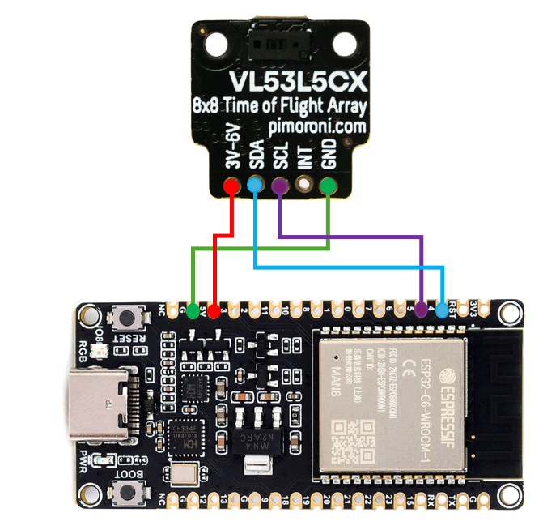

# Laser Distance Measurement with ESP32 for Experiments

Owner: **Kaveesha Abeysundara** (SID: 201578163)    

Project: **Automated Tracking of Assembly Line-Side Flow Rack Parts**   

School of Mechanical Engineering   
University of Leeds  
LS2 9JT


Arduino code and experimental setup for measuring distances using a VL53L1X laser time-of-flight sensor on an ESP32 board.

## Table of Contents

- [About](#about)
- [Hardware Setup](#hardware-setup)
- [Prerequisites](#prerequisites)
- [Installation](#installation)
- [Usage](#usage)
- [Experimentation & Data Logging](#experimentation--data-logging)
- [Repository Structure](#repository-structure)
- [License](#license)
- [Contact](#contact)

## About

This repository contains sketches and documentation for experiments with the VL53L1X laser time-of-flight (ToF) sensor on an ESP32. The code demonstrates how to initialize the sensor, perform range measurements and output timestamped distance readings over serial.

Full source code and wiring diagrams are available at [laserexperimentcode on GitHub](https://github.com/kav12ab/laserexperimentcode).

## Hardware Setup

Connect the VL53L1X sensor to an ESP32 as follows:

| Sensor Pin | ESP32 Pin | Description     |
|------------|-----------|-----------------|
| VIN        | 5V        | Sensor power    |
| GND        | GND       | Ground          |
| SDA        | 21        | I2C data line   |
| SCL        | 22        | I2C clock line  |
| XSHUT      | 19        | Optional reset  |

  
 

> Ensure 5 V and ground rails are common between sensor and ESP32.  


## Prerequisites

- Arduino IDE v1.8.10 or later
- ESP32 board support installed via Board Manager
- **VL53L1X** Arduino library (e.g., from Pololu or Adafruit)
- USB cable and ESP32 development board

## Installation

1. Clone the repository:
```bash
git clone https://github.com/kav12ab/laserexperimentcode.git
cd laserexperimentcode
```
2. Open `laser_experiment.ino` in the Arduino IDE.
3. Install the VL53L1X library if not already installed (**Sketch → Include Library → Manage Libraries**). Search for "VL53L1X" and install.

## Usage

1. Select your ESP32 board and COM port in Arduino IDE.
2. Upload `laser_experiment.ino` to the board.
3. Open the Serial Monitor at **115200 baud**.
4. Observe output lines in the format:
   ```
   <timestamp_ms>,<distance_mm>
   ```
5. Press the **XSHUT** pin low (via a jumper) to reset the sensor mid-run.

## Experimentation & Data Logging

- Readings are printed every 100 ms by default. You can change the interval in the `loop()` function.
- To log data, copy the serial output to a CSV file or use a serial-to-file tool (e.g., [PlatformIO Serial Monitor](https://docs.platformio.org/)).

## Repository Structure

```plaintext
laserexperimentcode/
├── .vscode/                           # JSON files for VSCODE Arduino Configuration
├── build/                             # Build logs, libraries and other files
├── laser_experiment.ino               # Main Arduino sketch
├── ESP32_VL53L1X_Wiring_Diagram.png   # Wiring Diagram
└── README.md                          # This file
```

## License

**All rights reserved.**

This code and documentation are proprietary. You may not copy, modify, or distribute without permission.

## Contact

**Author:** Kaveesha Abeysundara (SID: 201578163)  

Open an issue at [laserexperimentcode issues](https://github.com/kav12ab/laserexperimentcode/issues).

